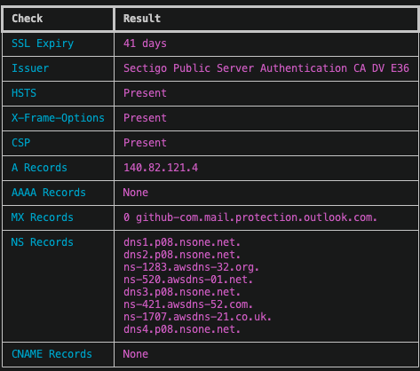

# domainaudit

  

A CLI tool that performs a quick security audit on a domain.

  

## What it checks

  

| Check | Description |
|-------|-------------|
| SSL Expiry | Certificate expiration date |
| Issuer | Certificate authority |
| HSTS | Strict-Transport-Security header presence |
| X-Frame-Options | Clickjacking protection header presence |
| CSP | Content-Security-Policy header presence |
| A Records | IPv4 record |
| AAAA Records | IPv6 records |
| MX Records | Mail records |
| NS Records | Name servers |
| CNAME Records | Alias records |
| TXT Records | Text records |
| SRV Records | Service records |
| PTR Records | Reverse lookup records |
| SOA Records | Start of authority records |Certification Authority Authorization
| SOA Records | Certification Authority Authorization records |


  

## Usage

  

```bash

python  domainaudit.py

```

  

## Example

  

```bash

python  domainaudit.py  github.com

```

## Example output



## Requirements

  

```bash

pip  install  -r  requirements.txt

```

  

## TODO

- DNS records (A, MX, TXT)

- SSL expiry in days instead of raw date

- Color coded output
